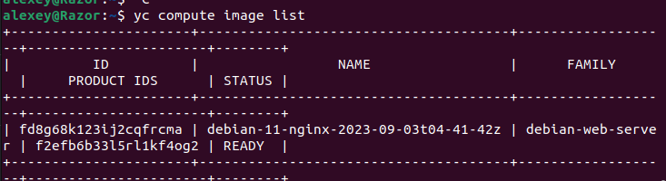
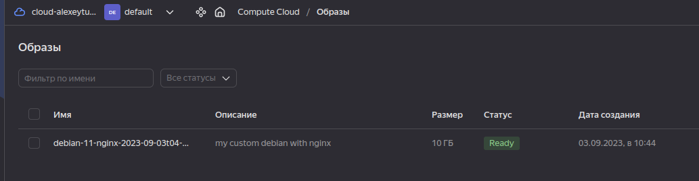

Home work Docker Compose

Задание 1
Создайте собственный образ любой операционной системы (например, debian-11) с помощью Packer версии 1.5.0 (инструкция).
Чтобы получить зачёт, вам нужно предоставить скриншот страницы с созданным образом из личного кабинета YandexCloud.

Ответ:
Созданный образ в YC

Задание 2
2.1. Создайте вашу первую виртуальную машину в YandexCloud с помощью web-интерфейса YandexCloud.

Ответ

Задание 3
С помощью Ansible и Docker Compose разверните на виртуальной машине из предыдущего задания систему мониторинга на основе Prometheus/Grafana. Используйте Ansible-код в директории (src/ansible).

Чтобы получить зачёт, вам нужно предоставить вывод команды "docker ps" , все контейнеры, описанные в docker-compose, должны быть в статусе "Up".

Ответ